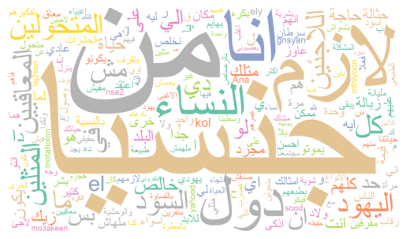

# Hate-Speech-Detection-in-Arabic
Hate Speech Detection in Arabic Using NLP

  

  <h2>  Overview:    </h2>
This project focuses on detecting hate speech in Arabic text using Natural Language Processing (NLP) techniques. The objective is to classify Arabic tweets or texts into hate speech or non-hate speech categories. Given the challenges of processing Arabic text due to its unique morphology and grammar, this project employs preprocessing techniques and machine learning model.

  
 
 

 

  

  <h2>  Dataset:  </h2>
We use a publicly available Arabic dataset for hate speech detection, which contains a collection of Arabic tweets labeled as "Hate Speech" or "Not Hate Speech".
     Dataset Source: https://github.com/rewire-online/multilingual-hatecheck

 

  

  <h2>   Preprocessing:  </h2>
Arabic text presents unique challenges in NLP due to its complex morphology and diacritics. This project uses the following preprocessing steps:   

==> Text Normalization: Convert text to a standard form.  
==> Tokenization: Use Farasa Segmenter for Arabic tokenization.  
==> Stopwords Removal: Remove common Arabic stopwords that do not contribute to text meaning.  
==> TF-IDF Vectorization: Convert text data into numerical form using TF-IDF.  

  
  

  

  <h2>   Model Training:  </h2>
We use Support Vector Machine (SVM) to classify the Arabic text into hate speech or non-hate speech

  

 
 
